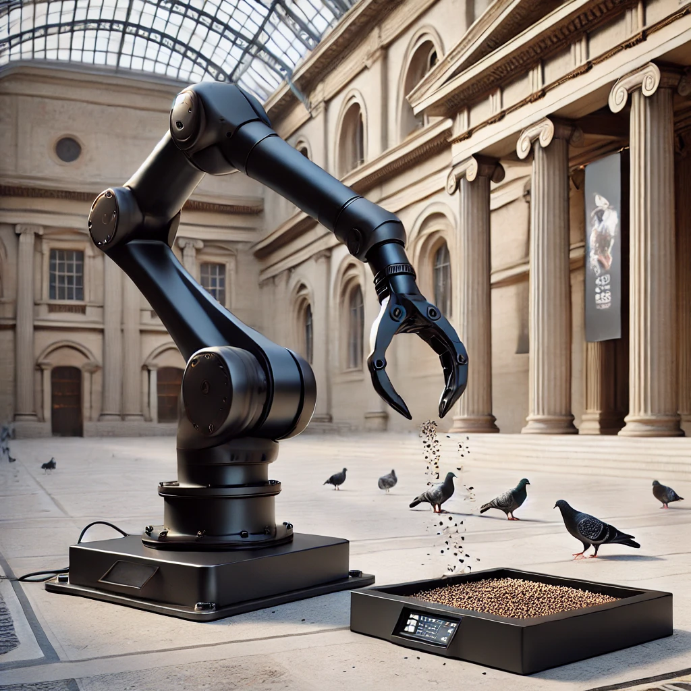
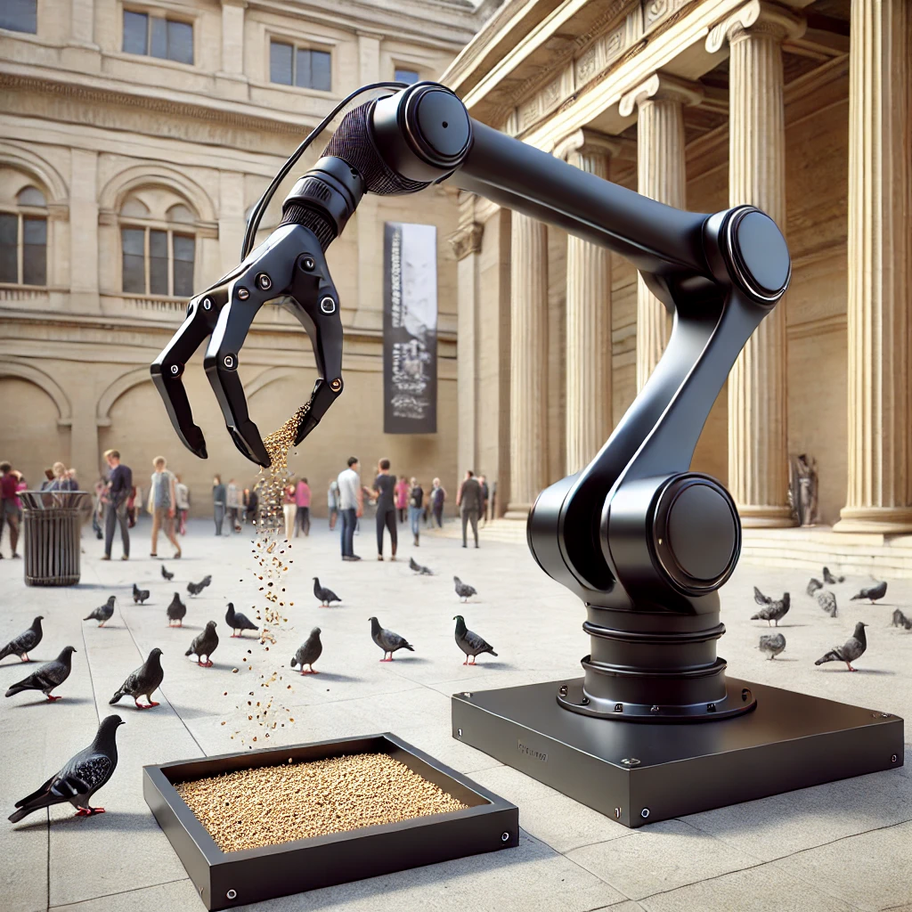

# Exhibitations and Iterations History

## 2024-01-01 | **Title of the Exhibition**
|    |    |    |
|----|----|----|
| **Title** | Title of the iteration or event | [link](https://linktoiterationifexist.net) |
| **Venue** | Place and address| https://museum.net |
| **person(s)** | name of the person involved (*role*), name of the person involved (*role*), ecc | |
| **Description** | *A presentation of the iteration with the necessary detail (also technical details if necessary)*: Lorem ipsum dolor sit amet, consectetur adipiscing elit. Phasellus vehicula nisl nec magna vehicula, a dictum odio elementum. Proin tincidunt eros vel metus varius, eget gravida nunc porttitor. Curabitur non ultrices neque. Ut nec justo a nulla fermentum efficitur. Donec porttitor, tortor eget interdum tempor, velit eros convallis risus, sit amet facilisis est lectus id justo. Pellentesque habitant morbi tristique senectus et netus et malesuada fames ac turpis egestas. Integer at justo felis. | |
| **Photo** |  | |
| | | |

### Component list (*bit*) 

Technical description, notes and information of the general artworks if needed

| **type** | **name** | **version** | **link** | **requirments** | **note** |
|---|----|----|---|---|---|
| hardware | **FakeArm** | | [repo link]() | | Lorem ipsum dolor sit amet, consectetur adipiscing elit. Vivamus lacinia odio vitae vestibulum. |
| computer system | **Raspberry PI** | 5 | [ext link]() | | |
| firmware | **fakeArmFirmare** | 2 | [repo link]() | | [Python 3.12](link)   [pyrobotic library](link)   [others](link) | Lorem ipsum dolor sit amet, consectetur adipiscing elit. Vivamus lacinia odio vitae vestibulum. |
| operating system | **Ubuntu** | 24.10 | [ext link]() | |
| ... | ... | ... | ... | ... |

### Technical note, mappings and instructions (*data*)
Technical Notes with pictures
Lorem ipsum dolor sit amet, consectetur adipiscing elit. Phasellus vehicula nisl nec magna vehicula, a dictum odio elementum. Proin tincidunt eros vel metus varius, eget gravida nunc porttitor. Curabitur non ultrices neque. Ut nec justo a nulla fermentum efficitur. Donec porttitor, tortor eget interdum tempor, velit eros convallis risus, sit amet facilisis est lectus id justo. Pellentesque habitant morbi tristique senectus et netus et malesuada fames ac turpis egestas. Integer at justo felis.

  

