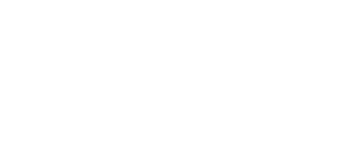
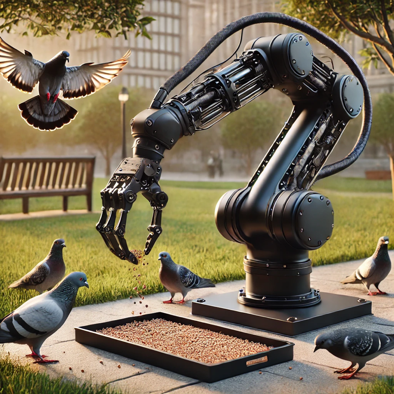

# Exhibitations and Iterations History

## 2024-01-01 | **Title of the Exhibition**
|    |    |    |
|----|----|----|
| **Title** | Title of the iteration or event | [link](https://linktoiterationifexist.net) |
| **Venue** | Place and address| https://museum.net |
| **Curator(s)** | | |
| **Performer(s)** | | |
| **Collaborator(s)** | | |
| **Description** | A long description of the iteration with the necessary detail (also technical details if necessary): Lorem ipsum dolor sit amet, consectetur adipiscing elit. Phasellus vehicula nisl nec magna vehicula, a dictum odio elementum. Proin tincidunt eros vel metus varius, eget gravida nunc porttitor. Curabitur non ultrices neque. Ut nec justo a nulla fermentum efficitur. Donec porttitor, tortor eget interdum tempor, velit eros convallis risus, sit amet facilisis est lectus id justo. Pellentesque habitant morbi tristique senectus et netus et malesuada fames ac turpis egestas. Integer at justo felis. | |
| Photo |  | |
| | | |

### Component list (*bit*) 

Technical description, notes and information of the general artworks if needed

| **type** | **name** | **version** | **link** | **requirments** | **note** |
|---|----|----|---|---|---|
| hardware | **FakeArm** | | [link to the documentation of the arm]() | | Lorem ipsum dolor sit amet, consectetur adipiscing elit. Vivamus lacinia odio vitae vestibulum. |
| computer system | **Raspberry PI** | 5 | [link]() | | |
| Firmware | **fakeArmFirmare** | [link to the firmare]() | [Python 3.12](link)   (pyrobotic library)[link]   [others](link) | Lorem ipsum dolor sit amet, consectetur adipiscing elit. Vivamus lacinia odio vitae vestibulum. |
| operating system | **Ubuntu** | 24.10 | [link]() | |
| video | | | [link to the firmare]() | |
| ... | ... | ... | ... | ... |

### Technical note, mappings and instructions (*data*)
Technical Notes with pictures

#### Conceptual mapping

To create a well-structured mapping description, refer to Baalman’s Composing Interaction book or the [repository](link). 

### Images (*data*)
  

## 2022-01-01 | **Title of the Exhibition**
|    |    |    |
|----|----|----|
| **Title** | Title of the iteration or event | [link](https://linktoiterationifexist.net) |
| **Venue** | Place and address| https://museum.net |
| **Curator(s)** | | |
| **Performer(s)** | | |
| **Collaborator(s)** | | |
| **Description** | A long description of the iteration with the necessary detail (also technical details if necessary): Lorem ipsum dolor sit amet, consectetur adipiscing elit. Phasellus vehicula nisl nec magna vehicula, a dictum odio elementum. Proin tincidunt eros vel metus varius, eget gravida nunc porttitor. Curabitur non ultrices neque. Ut nec justo a nulla fermentum efficitur. Donec porttitor, tortor eget interdum tempor, velit eros convallis risus, sit amet facilisis est lectus id justo. Pellentesque habitant morbi tristique senectus et netus et malesuada fames ac turpis egestas. Integer at justo felis. | |
| Photo |  | |
| | | |

